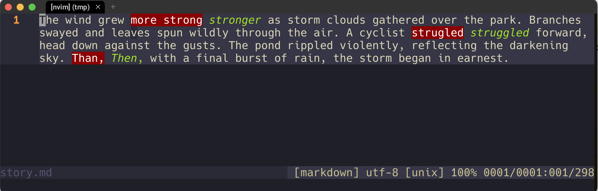

# Taal

A Neovim plugin that uses LLMs to improve the grammar and spelling of natural language text.

## Features

- Suggests grammar and spelling improvements. This feature is language agnostic, as long as the chosen LLM is capable of that.

- Offers a word-by-word diff of the original text and the suggested improvements.

- Applies improvements all at once, or on a one-to-one basis.

- Recognizes the language the text is written in and sets the correct `spelllang` option.
  
- Interacts with the LLM using a user command and the selected text.

- Supports three LLMs: Claude, Gemini, OpenAI-responses.



## Installation

This plugin uses `curl`.
- Make sure curl is installed on your system.
- This plugin has a dependency on [nvim-lua/plenary.nvim](https://github.com/nvim-lua/plenary.nvim) to access curl.

<details>
<summary>Example using <a href="https://nvim-mini.org/mini.nvim/readmes/mini-deps">mini.deps</a></summary>

```lua
MiniDeps.later(function()
  MiniDeps.add {
    source = "bennorichters/taal.nvim",
    depends = { "nvim-lua/plenary.nvim" },
  }

  require("taal").setup {}
end)
```
</details>

### API keys

The LLM's need an API key. These keys should be made available via an environment variable:

- Claude: `{{CLAUDE_API_KEY}}`
- Gemini: `{{GEMINI_API_KEY}}`
- OpenAI_responses: `{{OPENAI_API_KEY}}`

If you want to use Claude or OpenAI_responses, do not forget to configure the plugin accordingly, see below.

### Setup

This plugin needs to be set up with `require("taal").setup({})`. The setup arg `{}` is optional and can be a custom config table, to overwrite the defaults. Calling the setup function, with or without a table, is mandatory.

<details>
<summary>Default config</summary>
	
```lua
  {
    log_level = "error", -- one of: trace, debug, info, warn, error, fatal
    timeout = 6000, -- time out in ms, i.e., 6000 is six seconds

    adapters = {
      claude = {
        -- URL for Claude
        url = "https://api.anthropic.com",
      },
      gemini = {
        -- URL for Gemini
        url = "https://generativelanguage.googleapis.com"
      },
      openai_responses = {
        -- URL for Openai_responses
	      url = "https://api.openai.com", 
      },
    },

    -- default LLM and model, used by all commands if not overriden by one
    -- of the options below
    adapter = "gemini", -- one of: claude, gemini, openai_responses
    model = "gemini-2.5-flash", 

    commands = {
      grammar = {
  	    adapter = nil, -- overrides default LLM for TaalGrammar
	      model = nil, -- overrides default model for TaalGrammar
      },
      setspellang = {
	      adapter = nil,  -- overrides default LLM for TaalSetSpelllang
	      model = nil,  -- overrides default model for TaalSetSpelllang
      },
      interact = {
	      adapter = nil, -- overrides default LLM for TaalInteract
	      model = nil, -- overrides default model for TaalInteract
      },
    },
  }
```
</details>

<details>
<summary>Example config</summary>

This example uses Gemini and the model gemini-2.5-flash as the default LLM (because this config does not override the default), except for the interact command. For that command it will use Claude with the model claude-sonnet-4-5-20250929.
```lua
  require("taal").setup({ 
    commands = {
      interact = { 
	      adapter="claude", model="claude-sonnet-4-5-20250929", 
      }
    }
  })
```
</details>

## Commands
The following five commands are exposed:

- `TaalGrammar`  
  Checks grammar and spelling of the line of text currently under cursor. Grammar and spelling errors are highlighted with the 'TaalIssue' highlight group. This command takes two optional arguments:
  - <em>inlay</em> - Shows grammar and spelling improvements as inlay hints using the 'TaalInlay' highlight group.
  - <em>scratch</em> - Writes the complete improved line in a scratch buffer in a vertical split.
- `TaalHover`  
  Shows the grammar improvement of the text with the error currently under cursor in a popup.
- `TaalApplySuggestion`  
  Applies the suggested improvement of the text with the error currently under cursor. 
- `TaalSetSpelllang`  
  Recognizes the language of the text under cursor and sets the spelling language accordingly using the 'spelllang' option.
- `TaalInteract`  
  Asks the user for a prompt and sends this, together with the selected text to the LLM. Use in Visual Mode. Note that this ex command cannot be used by using `:TaalInteract` as using the colon will switch Neovim back to normal mode. Map this command to a key using `<Cmd>TaalInteract<Cr>` instead, as in the example below.

## Keymaps

No default keymaps are provided. Here is an example mapping you can use.

```lua
vim.keymap.set("n", "<leader>tg", "<Cmd>TaalGrammar scratch<Cr>")
vim.keymap.set("n", "<leader>tl", "<Cmd>TaalGrammar inlay<Cr>")
vim.keymap.set("n", "<leader>tr", "<Cmd>TaalGrammar<Cr>")
vim.keymap.set("n", "<leader>th", "<Cmd>TaalHover<Cr>")
vim.keymap.set("n", "<leader>ta", "<Cmd>TaalApplySuggestion<Cr>")
vim.keymap.set("n", "<leader>ts", "<Cmd>TaalSetSpelllang<Cr>")

-- Note that this mapping is for Visual Mode
vim.keymap.set("v", "<leader>ti", "<Cmd>TaalInteract<Cr>") 
```
